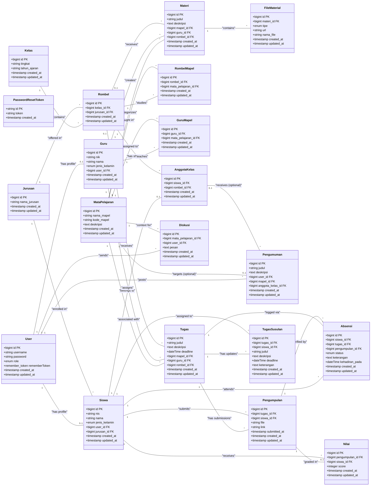

# DOKUMENTASI RANCANGAN BASIS DATA
## LEARNING MANAGEMENT SYSTEM (LMS)

Dokumen ini berisi rancangan basis data lengkap untuk aplikasi **Learning Management System (LMS)**. Dokumentasi ini mencakup:
1. **Diagram Hubungan Entitas (Entity Class Diagram)** menggunakan format Mermaid.
2. **Kamus Data (Tabel Skema)** lengkap yang siap disalin (copy-paste) ke Microsoft Word.

---

## 1. Class Diagram (Mermaid)

Berikut adalah diagram kelas yang menunjukkan entitas-entitas dalam sistem beserta tipe data, kunci utama (Primary Key), kunci tamu (Foreign Key), dan hubungan (association/relasi) antar tabel.

---

## 2. Kamus Data (Tabel Skema)

Berikut adalah struktur tabel lengkap dari rancangan basis data LMS. Anda dapat menyalin tabel di bawah ini dan langsung menempelkannya (*paste*) ke Microsoft Word.

### 2.1. Tabel `users`
Tabel ini digunakan untuk menyimpan data akun pengguna aplikasi LMS (Admin, Guru, Siswa).

| Nama Kolom | Tipe Data | Constraint | Keterangan |
| :--- | :--- | :--- | :--- |
| **id** | bigint unsigned | Primary Key, Auto Increment | ID unik pengguna |
| **username** | varchar(255) | Unique, Not Null | Username untuk login |
| **password** | varchar(255) | Not Null | Password terenkripsi (hash) |
| **role** | enum('admin', 'guru', 'siswa') | Not Null | Peran pengguna dalam sistem |
| **remember_token** | varchar(100) | Nullable | Token untuk sesi login persisten (remember me) |
| **created_at** | timestamp | Nullable | Waktu pembuatan baris data |
| **updated_at** | timestamp | Nullable | Waktu pembaruan baris data |

### 2.2. Tabel `password_reset_tokens`
Tabel pendukung untuk menyimpan token reset password pengguna.

| Nama Kolom | Tipe Data | Constraint | Keterangan |
| :--- | :--- | :--- | :--- |
| **id** | varchar(255) | Primary Key | ID email atau token identifier |
| **token** | varchar(255) | Not Null | Token reset password |
| **created_at** | timestamp | Nullable | Waktu pembuatan token |

### 2.3. Tabel `kelas`
Tabel ini menyimpan data tingkat kelas (contoh: X, XI, XII) beserta tahun ajaran.

| Nama Kolom | Tipe Data | Constraint | Keterangan |
| :--- | :--- | :--- | :--- |
| **id** | bigint unsigned | Primary Key, Auto Increment | ID unik kelas |
| **tingkat** | varchar(255) | Not Null | Tingkat kelas (misal: "X", "XI", "XII") |
| **tahun_ajaran** | varchar(255) | Not Null | Tahun ajaran (misal: "2025/2026") |
| **created_at** | timestamp | Nullable | Waktu pembuatan baris data |
| **updated_at** | timestamp | Nullable | Waktu pembaruan baris data |

### 2.4. Tabel `jurusan`
Tabel ini menyimpan daftar kompetensi keahlian/jurusan yang tersedia.

| Nama Kolom | Tipe Data | Constraint | Keterangan |
| :--- | :--- | :--- | :--- |
| **id** | bigint unsigned | Primary Key, Auto Increment | ID unik jurusan |
| **nama_jurusan** | varchar(255) | Not Null | Nama lengkap jurusan (misal: "Rekayasa Perangkat Lunak") |
| **created_at** | timestamp | Nullable | Waktu pembuatan baris data |
| **updated_at** | timestamp | Nullable | Waktu pembaruan baris data |

### 2.5. Tabel `mata_pelajaran`
Tabel ini berisi data semua mata pelajaran yang diajarkan di sekolah.

| Nama Kolom | Tipe Data | Constraint | Keterangan |
| :--- | :--- | :--- | :--- |
| **id** | bigint unsigned | Primary Key, Auto Increment | ID unik mata pelajaran |
| **nama_mapel** | varchar(255) | Not Null | Nama mata pelajaran |
| **kode_mapel** | varchar(255) | Unique, Not Null | Kode unik mata pelajaran |
| **deskripsi** | text | Nullable | Deskripsi singkat mengenai mapel |
| **created_at** | timestamp | Nullable | Waktu pembuatan baris data |
| **updated_at** | timestamp | Nullable | Waktu pembaruan baris data |

### 2.6. Tabel `guru`
Tabel profil untuk menyimpan data lengkap guru.

| Nama Kolom | Tipe Data | Constraint | Keterangan |
| :--- | :--- | :--- | :--- |
| **id** | bigint unsigned | Primary Key, Auto Increment | ID unik guru |
| **nik** | varchar(255) | Unique, Not Null | Nomor Induk Karyawan/Guru |
| **nama** | varchar(255) | Nullable | Nama lengkap guru |
| **jenis_kelamin** | enum('Laki-laki', 'Perempuan') | Nullable | Jenis kelamin |
| **user_id** | bigint unsigned | Foreign Key -> `users(id)`, On Delete Cascade | Relasi ke tabel pengguna (akun login) |
| **created_at** | timestamp | Nullable | Waktu pembuatan baris data |
| **updated_at** | timestamp | Nullable | Waktu pembaruan baris data |

### 2.7. Tabel `siswa`
Tabel profil untuk menyimpan data lengkap siswa.

| Nama Kolom | Tipe Data | Constraint | Keterangan |
| :--- | :--- | :--- | :--- |
| **id** | bigint unsigned | Primary Key, Auto Increment | ID unik siswa |
| **nis** | varchar(255) | Not Null | Nomor Induk Siswa |
| **nama** | varchar(255) | Not Null | Nama lengkap siswa |
| **jenis_kelamin** | enum('Laki-laki', 'Perempuan') | Nullable | Jenis kelamin |
| **user_id** | bigint unsigned | Foreign Key -> `users(id)`, On Delete Cascade | Relasi ke tabel pengguna (akun login) |
| **jurusan_id** | bigint unsigned | Foreign Key -> `jurusan(id)`, On Delete Set Null, Nullable | Relasi ke jurusan siswa |
| **created_at** | timestamp | Nullable | Waktu pembuatan baris data |
| **updated_at** | timestamp | Nullable | Waktu pembaruan baris data |

### 2.8. Tabel `rombel`
Tabel Rombongan Belajar (Rombel) yang menjembatani hubungan kelas dan jurusan.

| Nama Kolom | Tipe Data | Constraint | Keterangan |
| :--- | :--- | :--- | :--- |
| **id** | bigint unsigned | Primary Key, Auto Increment | ID unik rombel |
| **kelas_id** | bigint unsigned | Foreign Key -> `kelas(id)`, On Delete Cascade | Relasi ke kelas |
| **jurusan_id** | bigint unsigned | Foreign Key -> `jurusan(id)`, On Delete Cascade | Relasi ke jurusan |
| **created_at** | timestamp | Nullable | Waktu pembuatan baris data |
| **updated_at** | timestamp | Nullable | Waktu pembaruan baris data |

### 2.9. Tabel `anggota_kelas`
Tabel ini memetakan siswa ke rombongan belajar (rombel) tertentu secara unik.

| Nama Kolom | Tipe Data | Constraint | Keterangan |
| :--- | :--- | :--- | :--- |
| **id** | bigint unsigned | Primary Key, Auto Increment | ID unik anggota kelas |
| **siswa_id** | bigint unsigned | Foreign Key -> `siswa(id)`, On Delete Cascade, Unique | ID Siswa (Satu siswa hanya boleh di satu rombel) |
| **rombel_id** | bigint unsigned | Foreign Key -> `rombel(id)`, On Delete Cascade | ID Rombel tempat siswa terdaftar |
| **created_at** | timestamp | Nullable | Waktu pembuatan baris data |
| **updated_at** | timestamp | Nullable | Waktu pembaruan baris data |

### 2.10. Tabel `rombel_mapel`
Tabel persimpangan (*junction table*) untuk menghubungkan Rombel dengan Mata Pelajaran yang dipelajari.

| Nama Kolom | Tipe Data | Constraint | Keterangan |
| :--- | :--- | :--- | :--- |
| **id** | bigint unsigned | Primary Key, Auto Increment | ID unik rombel mapel |
| **rombel_id** | bigint unsigned | Foreign Key -> `rombel(id)`, On Delete Cascade | ID Rombel |
| **mata_pelajaran_id**| bigint unsigned | Foreign Key -> `mata_pelajaran(id)`, On Delete Cascade | ID Mata Pelajaran |
| **created_at** | timestamp | Nullable | Waktu pembuatan baris data |
| **updated_at** | timestamp | Nullable | Waktu pembaruan baris data |
| *Composite* | (rombel_id, mata_pelajaran_id) | Unique | Mencegah duplikasi mapel dalam satu rombel |

### 2.11. Tabel `guru_mapel`
Tabel persimpangan untuk mengaitkan guru dengan mata pelajaran yang mereka ampu.

| Nama Kolom | Tipe Data | Constraint | Keterangan |
| :--- | :--- | :--- | :--- |
| **id** | bigint unsigned | Primary Key, Auto Increment | ID unik guru mapel |
| **guru_id** | bigint unsigned | Foreign Key -> `guru(id)`, On Delete Cascade | ID Guru |
| **mata_pelajaran_id**| bigint unsigned | Foreign Key -> `mata_pelajaran(id)`, On Delete Cascade | ID Mata Pelajaran |
| **created_at** | timestamp | Nullable | Waktu pembuatan baris data |
| **updated_at** | timestamp | Nullable | Waktu pembaruan baris data |

### 2.12. Tabel `materi`
Tabel ini digunakan untuk mempublikasikan materi pembelajaran oleh guru.

| Nama Kolom | Tipe Data | Constraint | Keterangan |
| :--- | :--- | :--- | :--- |
| **id** | bigint unsigned | Primary Key, Auto Increment | ID unik materi |
| **judul** | varchar(255) | Not Null | Judul materi pembelajaran |
| **deskripsi** | text | Not Null | Penjelasan singkat atau isi deskripsi materi |
| **mapel_id** | bigint unsigned | Foreign Key -> `mata_pelajaran(id)`, On Delete Cascade | Mata pelajaran terkait |
| **guru_id** | bigint unsigned | Foreign Key -> `guru(id)`, On Delete Cascade | Guru pembuat materi |
| **rombel_id** | bigint unsigned | Foreign Key -> `rombel(id)`, On Delete Cascade, Nullable | Rombel target materi (opsional) |
| **created_at** | timestamp | Nullable | Waktu pembuatan materi |
| **updated_at** | timestamp | Nullable | Waktu pembaruan materi |

### 2.13. Tabel `file_material`
Tabel pendukung untuk menyimpan lampiran berkas materi (File, Video, Gambar, PDF, Link Youtube).

| Nama Kolom | Tipe Data | Constraint | Keterangan |
| :--- | :--- | :--- | :--- |
| **id** | bigint unsigned | Primary Key, Auto Increment | ID unik file materi |
| **materi_id** | bigint unsigned | Foreign Key -> `materi(id)`, On Delete Cascade | Relasi ke materi utama |
| **tipe** | enum('FILE', 'VIDEO', 'IMAGE', 'PDF', 'YOUTUBE') | Not Null | Tipe berkas/media materi |
| **url** | varchar(255) | Not Null | Path penyimpanan file atau link URL media |
| **nama_file** | varchar(255) | Not Null | Nama berkas lampiran |
| **created_at** | timestamp | Nullable | Waktu pengunggahan |
| **updated_at** | timestamp | Nullable | Waktu pembaruan berkas |

### 2.14. Tabel `pengumuman`
Tabel untuk menyebarkan informasi/pengumuman penting kepada siswa atau kelas tertentu.

| Nama Kolom | Tipe Data | Constraint | Keterangan |
| :--- | :--- | :--- | :--- |
| **id** | bigint unsigned | Primary Key, Auto Increment | ID unik pengumuman |
| **judul** | varchar(255) | Not Null | Judul pengumuman |
| **deskripsi** | text | Not Null | Detail isi pengumuman |
| **user_id** | bigint unsigned | Foreign Key -> `users(id)`, On Delete Cascade | Pengguna yang menerbitkan pengumuman |
| **mapel_id** | bigint unsigned | Foreign Key -> `mata_pelajaran(id)`, On Delete Set Null, Nullable | Terkait mata pelajaran tertentu (opsional) |
| **anggota_kelas_id**| bigint unsigned | Foreign Key -> `anggota_kelas(id)`, On Delete Cascade, Nullable | Ditargetkan ke siswa tertentu (opsional) |
| **created_at** | timestamp | Nullable | Waktu pembuatan pengumuman |
| **updated_at** | timestamp | Nullable | Waktu pembaruan pengumuman |

### 2.15. Tabel `diskusis`
Tabel forum diskusi real-time per mata pelajaran.

| Nama Kolom | Tipe Data | Constraint | Keterangan |
| :--- | :--- | :--- | :--- |
| **id** | bigint unsigned | Primary Key, Auto Increment | ID unik pesan diskusi |
| **mata_pelajaran_id**| bigint unsigned | Foreign Key -> `mata_pelajaran(id)`, On Delete Cascade | Ruang diskusi mata pelajaran |
| **user_id** | bigint unsigned | Foreign Key -> `users(id)`, On Delete Cascade | Pengirim pesan (guru/siswa) |
| **pesan** | text | Not Null | Isi pesan diskusi |
| **created_at** | timestamp | Nullable | Waktu pesan dikirim |
| **updated_at** | timestamp | Nullable | Waktu pesan diperbarui |

### 2.16. Tabel `tugas`
Tabel untuk mempublikasikan tugas atau evaluasi pembelajaran oleh guru.

| Nama Kolom | Tipe Data | Constraint | Keterangan |
| :--- | :--- | :--- | :--- |
| **id** | bigint unsigned | Primary Key, Auto Increment | ID unik tugas |
| **judul** | varchar(255) | Not Null | Judul tugas |
| **deskripsi** | text | Not Null | Instruksi pengerjaan tugas |
| **deadline** | datetime | Not Null | Batas akhir pengumpulan tugas |
| **mapel_id** | bigint unsigned | Foreign Key -> `mata_pelajaran(id)`, On Delete Cascade | Relasi ke mata pelajaran terkait |
| **guru_id** | bigint unsigned | Foreign Key -> `guru(id)`, On Delete Cascade | Guru pemberi tugas |
| **rombel_id** | bigint unsigned | Foreign Key -> `rombel(id)`, On Delete Set Null, Nullable | Rombel target tugas |
| **created_at** | timestamp | Nullable | Waktu pembuatan tugas |
| **updated_at** | timestamp | Nullable | Waktu pembaruan tugas |

### 2.17. Tabel `pengumpulan`
Tabel untuk menampung jawaban/berkas tugas yang dikumpulkan oleh siswa.

| Nama Kolom | Tipe Data | Constraint | Keterangan |
| :--- | :--- | :--- | :--- |
| **id** | bigint unsigned | Primary Key, Auto Increment | ID unik pengumpulan |
| **tugas_id** | bigint unsigned | Foreign Key -> `tugas(id)`, On Delete Cascade | Relasi ke tugas yang dikerjakan |
| **siswa_id** | bigint unsigned | Foreign Key -> `siswa(id)`, On Delete Cascade | Siswa yang mengumpulkan tugas |
| **file** | varchar(255) | Nullable | Path file jawaban (jika berupa berkas upload) |
| **link** | varchar(1000)| Nullable | Link eksternal (Google Drive/GitHub dll) |
| **submitted_at** | timestamp | Nullable | Waktu siswa menekan tombol kumpul |
| **created_at** | timestamp | Nullable | Catatan waktu pembuatan sistem |
| **updated_at** | timestamp | Nullable | Catatan waktu pembaruan sistem |

### 2.18. Tabel `absensi`
Tabel untuk mencatat kehadiran siswa berdasarkan pengumpulan tugas yang dikerjakan.

| Nama Kolom | Tipe Data | Constraint | Keterangan |
| :--- | :--- | :--- | :--- |
| **id** | bigint unsigned | Primary Key, Auto Increment | ID unik absensi |
| **siswa_id** | bigint unsigned | Foreign Key -> `siswa(id)`, On Delete Cascade | Siswa yang diabsen |
| **tugas_id** | bigint unsigned | Foreign Key -> `tugas(id)`, On Delete Cascade | Terkait dengan sesi tugas/pertemuan |
| **pengumpulan_id** | bigint unsigned | Foreign Key -> `pengumpulan(id)`, On Delete Cascade | Terkait pengumpulan tugas yang memicu absensi |
| **status** | enum('hadir', 'izin', 'sakit', 'alpha') | Default 'hadir' | Status kehadiran |
| **keterangan** | text | Nullable | Alasan izin/sakit/keterangan lain |
| **kehadiran_pada** | datetime | Nullable | Waktu pencatatan kehadiran |
| **created_at** | timestamp | Nullable | Waktu data dibuat |
| **updated_at** | timestamp | Nullable | Waktu data diperbarui |

### 2.19. Tabel `nilai`
Tabel rekapitulasi nilai siswa dari tugas/pengumpulan yang sudah diperiksa.

| Nama Kolom | Tipe Data | Constraint | Keterangan |
| :--- | :--- | :--- | :--- |
| **id** | bigint unsigned | Primary Key, Auto Increment | ID unik nilai |
| **pengumpulan_id** | bigint unsigned | Foreign Key -> `pengumpulan(id)`, On Delete Cascade | Relasi ke lembar kerja yang dikumpulkan |
| **siswa_id** | bigint unsigned | Foreign Key -> `siswa(id)`, On Delete Cascade | Siswa pemilik nilai |
| **score** | integer | Not Null | Angka nilai hasil evaluasi |
| **created_at** | timestamp | Nullable | Waktu nilai diinput |
| **updated_at** | timestamp | Nullable | Waktu nilai diperbarui |

### 2.20. Tabel `tugas_susulan`
Tabel untuk mendata pemberian tugas khusus/susulan kepada siswa tertentu dengan batas waktu tersendiri.

| Nama Kolom | Tipe Data | Constraint | Keterangan |
| :--- | :--- | :--- | :--- |
| **id** | bigint unsigned | Primary Key, Auto Increment | ID unik tugas susulan |
| **tugas_id** | bigint unsigned | Foreign Key -> `tugas(id)`, On Delete Cascade | Relasi ke tugas acuan utama |
| **siswa_id** | bigint unsigned | Foreign Key -> `siswa(id)`, On Delete Cascade | Siswa yang diberikan dispensasi susulan |
| **judul** | varchar(255) | Nullable | Judul tugas susulan khusus (jika berbeda) |
| **deskripsi** | text | Nullable | Deskripsi/instruksi tugas susulan |
| **deadline** | datetime | Not Null | Tenggat waktu baru untuk siswa tersebut |
| **keterangan** | text | Nullable | Catatan dispensasi (misal: "Dispensasi sakit") |
| **created_at** | timestamp | Nullable | Waktu dispensasi diberikan |
| **updated_at** | timestamp | Nullable | Waktu pembaruan dispensasi |

### 2.21. Tabel `cache`
Tabel default laravel untuk penyimpanan data sementara/cache sistem demi optimasi performa.

| Nama Kolom | Tipe Data | Constraint | Keterangan |
| :--- | :--- | :--- | :--- |
| **key** | varchar(255) | Primary Key | Key pengenal cache |
| **value** | mediumtext | Not Null | Nilai cache yang disimpan |
| **expiration** | bigint | Not Null | Waktu kedaluwarsa cache |

### 2.22. Tabel `cache_locks`
Tabel default laravel untuk mekanisme locking cache agar tidak terjadi data race.

| Nama Kolom | Tipe Data | Constraint | Keterangan |
| :--- | :--- | :--- | :--- |
| **key** | varchar(255) | Primary Key | Key pengenal lock |
| **owner** | varchar(255) | Not Null | Pemilik lock |
| **expiration** | bigint | Not Null | Waktu kedaluwarsa lock |

### 2.23. Tabel `jobs`
Tabel bawaan laravel queue untuk melacak pekerjaan latar belakang (background jobs).

| Nama Kolom | Tipe Data | Constraint | Keterangan |
| :--- | :--- | :--- | :--- |
| **id** | bigint unsigned | Primary Key, Auto Increment | ID unik job |
| **queue** | varchar(255) | Index, Not Null | Nama antrean (queue name) |
| **payload** | longtext | Not Null | Data serialize payload pekerjaan |
| **attempts** | tinyint unsigned | Not Null | Jumlah percobaan yang telah dilakukan |
| **reserved_at** | int unsigned | Nullable | Waktu pekerjaan mulai dikunci/dikerjakan |
| **available_at** | int unsigned | Not Null | Waktu pekerjaan siap untuk dieksekusi |
| **created_at** | int unsigned | Not Null | Waktu pembuatan antrean pekerjaan |

### 2.24. Tabel `failed_jobs`
Tabel bawaan laravel untuk menampung daftar pekerjaan latar belakang yang gagal dieksekusi.

| Nama Kolom | Tipe Data | Constraint | Keterangan |
| :--- | :--- | :--- | :--- |
| **id** | bigint unsigned | Primary Key, Auto Increment | ID unik job gagal |
| **uuid** | varchar(255) | Unique, Not Null | Identifier unik universal |
| **connection** | text | Not Null | Jenis koneksi queue |
| **queue** | text | Not Null | Nama antrean |
| **payload** | longtext | Not Null | Payload data job |
| **exception** | longtext | Not Null | Stacktrace/detail error penyebab kegagalan |
| **failed_at** | timestamp | Default CURRENT_TIMESTAMP | Waktu terjadinya kegagalan |
